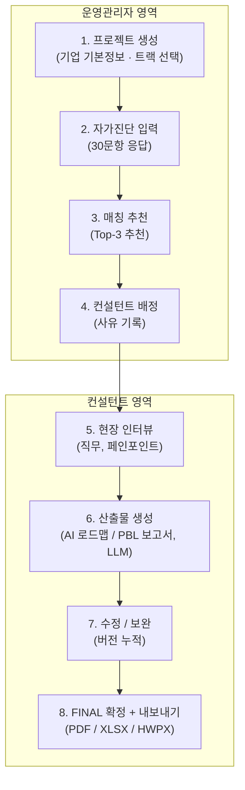
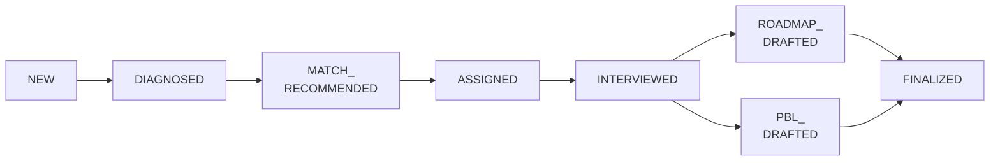
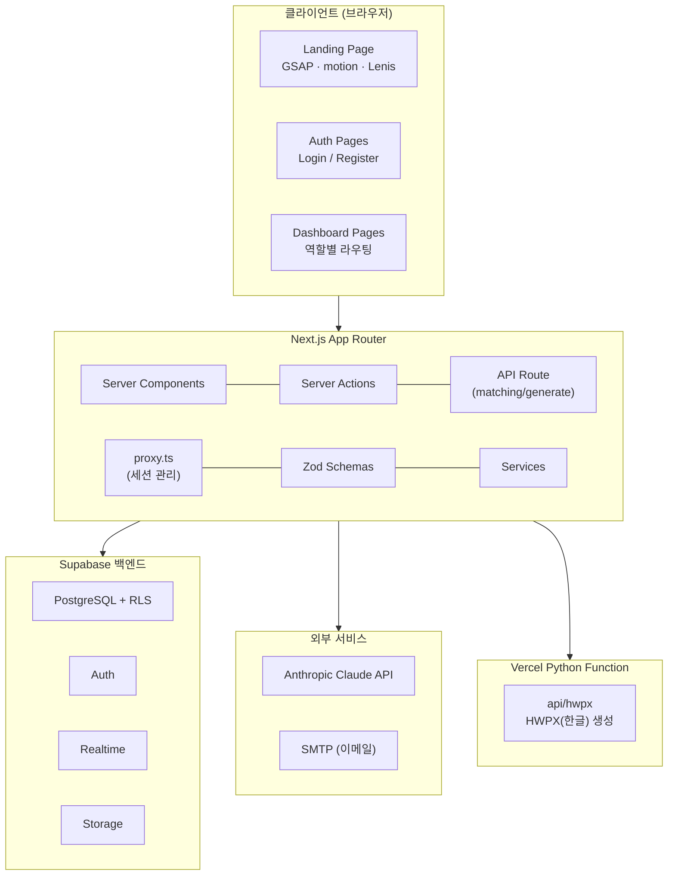
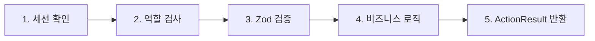
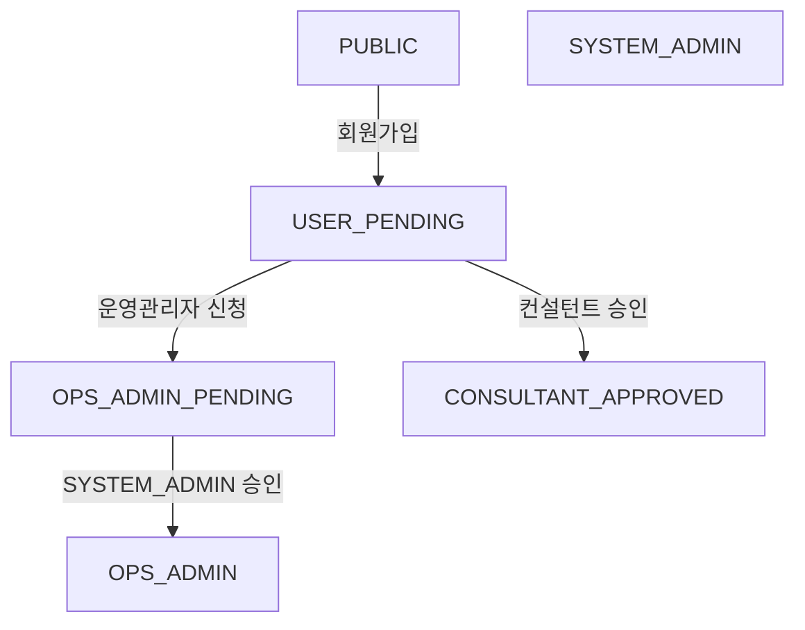
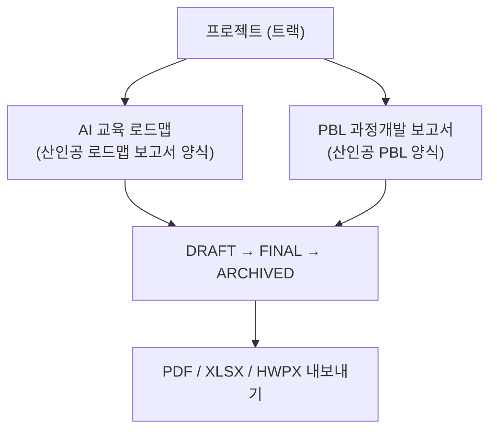

# KPC AI 훈련 로드맵 대시보드

> **기업 AI 교육 진단 · 컨설턴트 매칭 · 현장 인터뷰 · 교육 로드맵/PBL 산출**을 위한 B2B 내부용 대시보드

---

## 목차

- [개요](#개요)
- [주요 기능](#주요-기능)
- [워크플로우](#워크플로우)
- [기술 스택](#기술-스택)
- [시작하기](#시작하기)
- [스크립트](#스크립트)
- [환경 변수](#환경-변수)
- [프로젝트 구조](#프로젝트-구조)
- [아키텍처](#아키텍처)
- [사용자 역할](#사용자-역할)
- [산출물 형식](#산출물-형식)
- [보안](#보안)
- [데모](#데모)
- [문서](#문서)
- [배포](#배포)
- [라이선스](#라이선스)

---

## 개요

KPC(한국생산성본부) AI 훈련 확산센터에서 사용하는 **기업 AI 교육 로드맵 관리 시스템**입니다.

기업의 AI 성숙도를 진단하고, 최적의 컨설턴트를 매칭한 뒤, 현장 인터뷰를 거쳐 맞춤형 산출물을 생성합니다. 산출물은 두 트랙으로 나뉩니다 — **AI 교육 로드맵**(한국산업인력공단 로드맵 보고서 양식)과 **PBL 과정개발 보고서**(한국산업인력공단 PBL 양식). Anthropic Claude 기반 자동 생성, DRAFT/FINAL 버전 관리, PDF·Excel·HWPX(한글) 내보내기까지 하나의 플랫폼에서 처리합니다.

---

## 주요 기능

| 기능                    | 설명                                                                                                 |
| ----------------------- | ---------------------------------------------------------------------------------------------------- |
| **기업 자가진단**       | 30문항·5개 영역(AI 성숙도/데이터/인프라/인력/문제 명확성) 기반 AI 성숙도 진단 및 점수화 (100점 만점) |
| **자가진단 공개 링크**  | 토큰 기반 외부 응답 링크 — 로그인 없이 기업이 진단에 응답                                            |
| **컨설턴트 매칭**       | 자가진단 + 기업정보 기반 LLM Top-3 추천                                                              |
| **현장 인터뷰 관리**    | 트랙별(로드맵/PBL) 단계별 폼 — 세부직무, 병목/페인포인트, 개선 목표, 첨부파일                        |
| **인터뷰 가이드**       | LLM 기반 인터뷰 사전 가이드 생성                                                                     |
| **STT 인사이트 추출**   | 인터뷰 녹취 텍스트에서 로드맵 수립 정보를 LLM이 자동 추출                                            |
| **AI 교육 로드맵 생성** | LLM 기반 산인공 로드맵 보고서 양식(역량 모델링·훈련체계도·연간 훈련계획·훈련과정 명세서) 자동 생성   |
| **PBL 과정개발 보고서** | LLM 기반 산인공 PBL 양식(운영계획·성과분석·확산전략) 자동 생성                                       |
| **버전 관리**           | DRAFT / FINAL / ARCHIVED 버전 관리, 수정 요청 히스토리                                               |
| **내보내기**            | PDF / XLSX / HWPX(한글) 다운로드 (저장된 데이터 활용, LLM 재호출 없음)                               |
| **로드맵 갤러리**       | FINAL 산출물 공유 및 좋아요 (로드맵·PBL 통합)                                                        |
| **컨설턴트 대시보드**   | KPI 요약, 최근 활동, 프로젝트 현황                                                                   |
| **활동 로그**           | 프로젝트 단위 활동 타임라인                                                                          |
| **통합 검색**           | 커맨드 팔레트 기반 전체 검색                                                                         |
| **DM 메시징**           | 1:1 실시간 대화 (Supabase Realtime)                                                                  |
| **알림 시스템**         | 프로젝트 배정, 메시지 수신 등 인앱 실시간 알림                                                       |
| **이메일 알림**         | 신규 DM 메시지 수신 시 이메일 발송 (SMTP)                                                            |
| **공지사항**            | 운영관리자 공지 작성·관리, 사용자 열람                                                               |
| **진단 템플릿**         | 자가진단 설문 템플릿 생성 및 관리                                                                    |
| **사용자 관리**         | 역할 기반 접근 제어, 승인 워크플로우                                                                 |
| **감사로그**            | 모든 주요 이벤트 자동 기록 (승인, 배정, 생성 등)                                                     |
| **LLM 쿼터**            | 일별/월별 LLM 호출 제한으로 비용 관리                                                                |
| **모바일 반응형**       | 전체 대시보드 모바일/태블릿 대응                                                                     |
| **연습 모드**           | 컨설턴트가 실제 프로젝트 없이 로드맵·PBL 생성을 연습                                                 |

---

## 워크플로우

### 전체 흐름



### 프로젝트 상태 흐름

프로젝트는 생성 시 **로드맵** 또는 **PBL** 트랙을 가지며, 트랙에 따라 드래프트 단계가 갈립니다.



---

## 기술 스택

### 핵심 프레임워크

| 분류       | 기술                                  | 버전 |
| ---------- | ------------------------------------- | ---- |
| 프레임워크 | Next.js (App Router · React Compiler) | 16.x |
| 언어       | TypeScript (strict 모드)              | 5.x  |
| 런타임     | React                                 | 19.x |
| 런타임     | Node.js                               | 20.x |

### AI / 백엔드 / 데이터

| 분류         | 기술                                                                  | 용도                                           |
| ------------ | --------------------------------------------------------------------- | ---------------------------------------------- |
| LLM          | Anthropic Claude (`@anthropic-ai/sdk`, 기본 모델 `claude-sonnet-4-6`) | 매칭·로드맵·PBL·인터뷰 가이드·STT 추출 생성    |
| 데이터베이스 | Supabase PostgreSQL (`@supabase/supabase-js` · `@supabase/ssr`)       | 데이터 저장, RLS 보안                          |
| 인증         | Supabase Auth                                                         | 회원가입, 로그인, 세션 관리                    |
| 실시간       | Supabase Realtime                                                     | 메시지 실시간 구독                             |
| 스토리지     | Supabase Storage                                                      | 인터뷰 첨부파일·HRD 보고서 저장                |
| 이메일       | nodemailer                                                            | SMTP 기반 이메일 발송                          |
| API 패턴     | Server Actions 우선                                                   | API Routes는 스트리밍·외부 호출 등 특수 경우만 |

### 프론트엔드

| 분류          | 기술                                               | 용도                          |
| ------------- | -------------------------------------------------- | ----------------------------- |
| 스타일링      | Tailwind CSS 4.x                                   | 유틸리티 기반 CSS             |
| UI 컴포넌트   | Radix UI + shadcn/ui (clsx · tailwind-merge · cva) | 접근성 보장 헤드리스 컴포넌트 |
| 아이콘        | Lucide React                                       | 아이콘 라이브러리             |
| 폼/검증       | Zod (네이티브 HTML 폼, RHF 미사용)                 | 스키마 기반 입력 검증         |
| 차트          | Recharts                                           | 데이터 시각화                 |
| 토스트        | Sonner                                             | 알림 메시지                   |
| 커맨드 팔레트 | cmdk                                               | 통합 검색 UI                  |
| 애니메이션    | GSAP + motion(구 Framer Motion) + Lenis            | 랜딩 스크롤/전환 애니메이션   |

### 내보내기 / 문서 처리

| 분류      | 기술                             | 용도                        |
| --------- | -------------------------------- | --------------------------- |
| PDF       | jspdf + jspdf-autotable          | 로드맵/PBL PDF 생성         |
| Excel     | xlsx-js-style (SheetJS 포크)     | 로드맵/PBL XLSX 생성        |
| HWPX      | Python (Vercel Function) + jszip | 한글(HWPX) 문서 생성        |
| 파일 파싱 | mammoth(DOCX) · pdfjs-dist(PDF)  | 인터뷰 첨부파일 텍스트 추출 |

### 테스트 / 품질

| 분류        | 기술                           | 용도                           |
| ----------- | ------------------------------ | ------------------------------ |
| 단위 테스트 | Vitest + React Testing Library | 스키마 검증, 컴포넌트 테스트   |
| E2E 테스트  | Playwright                     | 브라우저 통합 테스트           |
| Dead code   | knip                           | 미사용 파일·export·의존성 탐지 |
| 린트/포맷   | ESLint 9.x + Prettier          | 코드 품질 관리                 |
| Git hooks   | Husky                          | 커밋 전 검증 자동화            |

---

## 시작하기

### 사전 요구사항

- **Node.js** 20.x
- **npm** (Node.js에 포함)
- **Supabase** 프로젝트 ([supabase.com](https://supabase.com)에서 생성)
- **Anthropic Claude API 키** ([console.anthropic.com](https://console.anthropic.com))
- (선택) **Python 3.x** — HWPX(한글) 내보내기 로컬 테스트 시

### 1단계: 저장소 클론 및 의존성 설치

```bash
git clone <repository-url>
cd ai-roadmap-dashboard
npm install
```

### 2단계: 환경 변수 설정

```bash
cp .env.example .env.local
```

`.env.local` 파일을 열어 실제 값을 입력합니다. 필수 항목은 [환경 변수](#환경-변수) 섹션을 참고하세요.

### 3단계: 데이터베이스 마이그레이션

`supabase/migrations/` 폴더의 SQL 파일(`001_initial_schema.sql` ~ `073_consultant_can_edit_company_info.sql`, 총 70개)을 **번호 순서대로** 적용합니다.

**방법 A: 로컬 Supabase (Docker 필요)**

```bash
npm run db:start   # 로컬 Supabase 시작
npm run db:reset   # 마이그레이션 일괄 재적용
```

**방법 B: Supabase CLI로 원격 적용**

```bash
npm install -g supabase
supabase db push
```

**방법 C: Supabase 대시보드 SQL Editor에서 번호 순서대로 직접 실행**

### 4단계: 개발 서버 실행

```bash
npm run dev
```

[http://localhost:3000](http://localhost:3000)에서 확인합니다.

> **HWPX(한글) 내보내기 로컬 테스트**: `/api/hwpx/*`는 Vercel Python Function이라 `next dev`에서 동작하지 않습니다. 브리지 서버를 사용하세요 — `npm run dev:hwpx:setup`(최초 1회) → 터미널 A `npm run dev:hwpx`(포트 3010) → 터미널 B `npm run dev:with-hwpx`(포트 3000 프록시).

---

## 스크립트

### 개발

| 명령어                   | 설명                                                     |
| ------------------------ | -------------------------------------------------------- |
| `npm run dev`            | 개발 서버 시작 (localhost:3000)                          |
| `npm run dev:vercel`     | Vercel dev (Python Functions 포함, HWPX 다운로드 테스트) |
| `npm run dev:hwpx:setup` | HWPX Python venv 최초 1회 설치                           |
| `npm run dev:hwpx`       | HWPX 브리지 서버 (포트 3010)                             |
| `npm run dev:with-hwpx`  | Next.js + HWPX 프록시 (포트 3000)                        |

### 빌드 / 품질

| 명령어                            | 설명                                          |
| --------------------------------- | --------------------------------------------- |
| `npm run build`                   | 프로덕션 빌드                                 |
| `npm run start`                   | 프로덕션 서버 실행                            |
| `npm run lint` / `lint:fix`       | ESLint 검사 / 자동 수정                       |
| `npm run typecheck`               | TypeScript 타입 검사                          |
| `npm run format` / `format:check` | Prettier 포맷팅 / 검사                        |
| `npm run knip`                    | 미사용 파일·export·의존성 탐지 (dead code)    |
| `npm run validate`                | typecheck + lint + test 통합 검증 (CI와 동일) |
| `npm run analyze`                 | 번들 크기 분석 (webpack)                      |

### 테스트

| 명령어                                                        | 설명                                 |
| ------------------------------------------------------------- | ------------------------------------ |
| `npm run test` / `test:watch` / `test:coverage`               | 단위 테스트 (Vitest)                 |
| `npm run test:e2e`                                            | E2E 테스트 (Playwright)              |
| `npm run test:e2e:ui` / `test:e2e:headed` / `test:e2e:report` | E2E UI / 브라우저 표시 / 리포트      |
| `npm run test:e2e:setup`                                      | E2E용 로컬 DB 초기화                 |
| `npm run test:perf`                                           | 성능 측정 E2E (performance 프로젝트) |
| `npm run lighthouse:ci`                                       | Lighthouse CI 실행                   |

### 데이터베이스 (로컬 Supabase)

| 명령어                         | 설명                                    |
| ------------------------------ | --------------------------------------- |
| `npm run db:start` / `db:stop` | 로컬 Supabase 시작 / 중지 (Docker 필요) |
| `npm run db:reset`             | 로컬 DB 리셋 (마이그레이션 재적용)      |

---

## 환경 변수

### 필수

| 변수명                          | 설명                                                      |
| ------------------------------- | --------------------------------------------------------- |
| `NEXT_PUBLIC_SUPABASE_URL`      | Supabase 프로젝트 URL                                     |
| `NEXT_PUBLIC_SUPABASE_ANON_KEY` | Supabase 익명 키 (브라우저 사용 가능)                     |
| `SUPABASE_SERVICE_ROLE_KEY`     | Supabase 서비스 역할 키 (서버 전용)                       |
| `LLM_API_KEY`                   | Anthropic Claude API 키 (서버 전용, 클라이언트 노출 금지) |

### 선택

| 변수명                   | 설명                                                    | 기본값                  |
| ------------------------ | ------------------------------------------------------- | ----------------------- |
| `DAILY_LLM_CALL_LIMIT`   | 일별 LLM 호출 제한                                      | 50                      |
| `MONTHLY_LLM_CALL_LIMIT` | 월별 LLM 호출 제한                                      | 500                     |
| `NEXT_PUBLIC_APP_URL`    | 앱 URL                                                  | <http://localhost:3000> |
| `SMTP_HOST`              | SMTP 서버 호스트                                        | smtp.gmail.com          |
| `SMTP_PORT`              | SMTP 포트                                               | 465                     |
| `SMTP_USER`              | SMTP 사용자                                             | —                       |
| `SMTP_PASS`              | SMTP 비밀번호                                           | —                       |
| `EMAIL_FROM`             | 발신자 이메일 주소                                      | —                       |
| `HWPX_API_SECRET`        | HWPX 생성 함수 인증 시크릿 (프로덕션 HWPX 사용 시 필수) | —                       |
| `HWPX_DEV_PROXY_URL`     | 로컬 HWPX 브리지 서버 URL (로컬 HWPX 개발 시)           | —                       |

> Vercel 배포 시 `VERCEL_URL`, `VERCEL_AUTOMATION_BYPASS_SECRET`은 플랫폼이 자동 주입하므로 별도 설정이 필요 없습니다.

---

## 프로젝트 구조

```
ai-roadmap-dashboard/
|
|-- src/
|   |-- app/                          # Next.js App Router
|   |   |-- page.tsx                  # 랜딩 페이지 (components/landing 위임)
|   |   |-- layout.tsx · globals.css  # 루트 레이아웃 · 전역 스타일
|   |   |-- demo/                     # 로그인 없이 체험 가능한 데모
|   |   |-- assessment/[token]/       # 토큰 기반 자가진단 공개 응답 링크
|   |   |-- api/                      # API Route (Server Actions 우선이라 최소)
|   |   |   `-- matching/generate/    #   매칭 생성 (유일한 라우트 핸들러)
|   |   |-- (auth)/                   # 인증 라우트 그룹
|   |   |   |-- login · register                  # 로그인 · 회원가입
|   |   |   |-- forgot-password · reset-password  # 비밀번호 찾기 · 재설정
|   |   |   `-- actions/              # 인증 Server Actions (auth·account·admin·profile)
|   |   `-- (dashboard)/              # 인증 필요 라우트 그룹
|   |       |-- dashboard/            # 공통 대시보드
|   |       |   |-- messages/         #   DM 메시징 (1:1 실시간 대화)
|   |       |   |-- profile/          #   프로필 조회
|   |       |   `-- settings/         #   계정 설정 (비밀번호, 탈퇴)
|   |       |-- consultant/           # 컨설턴트 전용
|   |       |   |-- home/             #   대시보드 (KPI, 최근 활동)
|   |       |   |-- profile/          #   프로필 작성/수정
|   |       |   `-- projects/[id]/    #   배정 프로젝트
|   |       |       |-- interview/    #     현장 인터뷰 (+ review)
|   |       |       |-- roadmap/      #     AI 교육 로드맵 생성/조회
|   |       |       `-- pbl/          #     PBL 과정개발 보고서 생성/조회
|   |       |-- gallery/[id]/         # 로드맵 갤러리 (공유/좋아요)
|   |       |-- notices/[id]/         # 공지사항 열람
|   |       |-- notifications/        # 알림 (Server Action 전용)
|   |       |-- search/               # 통합 검색 (Server Action 전용)
|   |       |-- ops/                  # 운영관리자 전용
|   |       |   |-- projects/[id]/    #   프로젝트 CRUD, 진단, 배정 (roadmap·pbl 조회)
|   |       |   |-- users/            #   사용자 승인 관리
|   |       |   |-- templates/        #   진단 템플릿
|   |       |   |-- audit/            #   감사로그 조회
|   |       |   |-- quota/            #   LLM 쿼터 현황
|   |       |   `-- notices/          #   공지 작성/관리 (CRUD)
|   |       |-- test-roadmap/         # 로드맵 연습 (실제 프로젝트 없이)
|   |       `-- test-pbl/             # PBL 연습 (실제 프로젝트 없이)
|   |
|   |-- components/                   # 공유 컴포넌트 (17개 도메인 디렉터리)
|   |   |-- ui/                       # shadcn/ui + 커스텀 UI (38개 컴포넌트)
|   |   |-- landing/                  # 랜딩 (Hero, AuroraBackground, SmoothScroll 등)
|   |   |-- ops/ · consultant/        # 운영관리 · 컨설턴트
|   |   |-- roadmap/ · pbl/           # 로드맵 · PBL 결과 렌더링
|   |   |-- interview/ · assessment/  # 인터뷰 · 자가진단
|   |   |-- gallery/ · notices/       # 갤러리 · 공지
|   |   |-- charts/ · forms/          # 차트 · 폼
|   |   |-- command-palette/          # 커맨드 팔레트 (통합 검색)
|   |   |-- auth/ · common/ · layout/ · result/
|   |   `-- Navigation · NotificationBell · MessageIcon · PendingApprovalCard
|   |
|   |-- lib/                          # 비즈니스 로직 및 유틸리티
|   |   |-- services/                 # 핵심 서비스
|   |   |   |-- roadmap/              #   로드맵 생성·검증·CRUD·매트릭스·프롬프트
|   |   |   |-- pbl/                  #   PBL 보고서 생성·검증·CRUD·프롬프트
|   |   |   |-- matching/             #   컨설턴트 매칭 (LLM)
|   |   |   |-- export/               #   내보내기 (pdf/ · xlsx/ · hwpx/)
|   |   |   |-- file-parser/          #   첨부파일 텍스트 추출 (DOCX/PDF/이미지/PPTX/XLSX)
|   |   |   |-- interview/ · storage/ #   인터뷰 변환 · 스토리지 서명 URL
|   |   |   |-- llm.ts                #   Anthropic Claude 호출 추상화
|   |   |   |-- quota.ts              #   LLM 호출 쿼터 관리
|   |   |   |-- notification.ts       #   인앱 알림 생성
|   |   |   |-- email.ts              #   이메일 발송 (SMTP)
|   |   |   |-- interview-guide.ts    #   인터뷰 가이드 생성
|   |   |   |-- stt.ts                #   STT 인사이트 추출
|   |   |   |-- audit.ts              #   감사로그 기록
|   |   |   |-- activity-log.ts       #   활동 로그
|   |   |   |-- notice.ts             #   공지사항
|   |   |   `-- abort-registry.ts     #   LLM 호출 중단 관리
|   |   |-- schemas/                  # Zod 검증 스키마 (17종, *.test.ts 코로케이션)
|   |   |-- constants/                # 상수 (역할, 상태, 업종, 네비게이션 등)
|   |   |-- supabase/                 # Supabase 클라이언트 (client·server·admin·middleware·cached)
|   |   |-- actions/                  # 공유 Server Action 헬퍼 (인증·내보내기)
|   |   |-- types/ · utils/ · utils.ts
|   |   |-- data/                     # 정적 데이터 (데모 샘플)
|   |   `-- fixtures/                 # 인터뷰 샘플 픽스처
|   |
|   |-- hooks/                        # 커스텀 React 훅 (8개)
|   |   |-- useDebounce · useCommandPalette · useRecentVisits
|   |   |-- useRoadmapDownload · usePBLDownload · useHwpxDownload
|   |   `-- useBeforeUnloadGuard · useRowHeightSync
|   |
|   |-- types/                        # 전역 TypeScript 타입
|   |   |-- database.ts               #   Supabase DB 타입 (수동 작성)
|   |   |-- roadmap-ui.ts             #   로드맵 UI 타입
|   |   `-- jspdf-autotable.d.ts      #   타입 선언
|   |
|   |-- test/                         # 테스트 설정 (setup, helpers)
|   `-- proxy.ts                      # Next.js 미들웨어 (세션 관리)
|
|-- api/                              # Vercel Python Function (Next.js 외부)
|   `-- hwpx/                         #   HWPX(한글) 생성 — generate.py · ping.py
|
|-- supabase/
|   `-- migrations/                   # SQL 마이그레이션 (70개, 001 ~ 073)
|
|-- docs/                             # 프로젝트 문서
|   |-- ARCHITECTURE.md               #   시스템 아키텍처
|   |-- RLS.md                        #   Row-Level Security 정책
|   |-- DECISIONS.md                  #   아키텍처 결정 기록 (ADR)
|   |-- CONSULTANT_PROFILE_SPEC.md    #   컨설턴트 프로필 명세
|   |-- PERFORMANCE_BUDGET.md         #   성능 예산·측정 기준
|   |-- PROJECT_OUTLINE.md            #   초기 기획서 (아카이브)
|   |-- plans/ · decisions/           #   기능 설계 · 날짜별 ADR
|   |-- references/ · prompts/        #   참조 문서 · LLM 프롬프트
|   |-- reports/ · testing/           #   감사·리뷰 보고서 · 테스트
|   `-- archive/                      #   legacy 문서
|
|-- public/                           # 정적 파일 (로고 등)
`-- scripts/                          # 유틸리티 스크립트 (HWPX 브리지 등)
```

---

## 아키텍처

### 시스템 구조



### Supabase 클라이언트 전략

각 실행 환경에 맞는 전용 클라이언트를 사용합니다:

| 클라이언트 | 파일            | 사용 위치                  | 특징                     |
| ---------- | --------------- | -------------------------- | ------------------------ |
| Browser    | `client.ts`     | 클라이언트 컴포넌트        | anon key, RLS 적용       |
| Server     | `server.ts`     | Server Components, Actions | 세션 갱신 포함, RLS 적용 |
| Admin      | `admin.ts`      | 내부 작업 전용             | 서비스 역할, RLS 우회    |
| Middleware | `middleware.ts` | `proxy.ts` 세션 확인       | 세션 확인 전용           |

> 이 밖에 `cached.ts`는 서버 조회 결과 캐싱 래퍼를 제공합니다.

### Server Action 패턴

모든 Server Action은 동일한 5단계 패턴을 따릅니다:



---

## 사용자 역할

시스템은 6가지 역할로 접근을 제어합니다 (정의 출처: `src/types/database.ts`):



| 역할                  | 접근 가능 영역                                                        |
| --------------------- | --------------------------------------------------------------------- |
| `PUBLIC`              | 랜딩 페이지, 데모, 자가진단 공개 링크                                 |
| `USER_PENDING`        | 로그인 후 승인 대기 화면                                              |
| `OPS_ADMIN_PENDING`   | 로그인 후 운영관리자 승인 대기 화면                                   |
| `CONSULTANT_APPROVED` | 프로필, 배정된 프로젝트, 인터뷰, 로드맵/PBL, 연습 모드                |
| `OPS_ADMIN`           | 프로젝트 관리, 사용자 승인, 템플릿, 감사로그, 쿼터, 공지, 산출물 조회 |
| `SYSTEM_ADMIN`        | 전체 시스템 관리                                                      |

---

## 산출물 형식

프로젝트는 **로드맵** 또는 **PBL** 트랙을 가지며, 트랙별로 한국산업인력공단 공식 양식에 맞춘 산출물을 LLM이 생성합니다. 두 산출물 모두 DRAFT/FINAL/ARCHIVED 버전 관리와 PDF/XLSX/HWPX 내보내기를 지원합니다.



### AI 교육 로드맵 (산인공 로드맵 보고서 양식 Ⅰ·Ⅲ장)

| 구성                  | 내용                                                                     |
| --------------------- | ------------------------------------------------------------------------ |
| 수립 필요성·주요 결과 | AI 역량 수준, 선정 직무, 주요 학습 내용 요약                             |
| 역량 모델링           | 역량별 정의·지식·기술·태도 (+ NCS 활용 여부·근거)                        |
| 훈련체계도            | **역량 × 훈련수준(초급/중급/고급)** 매트릭스 (대상·방법·목표)            |
| 연간 훈련계획         | 역량별 과정·형태·시간·비고 + 운영 계획                                   |
| 훈련과정 명세서       | **최소 3개 과정** (과정명·형태·권장 프로그램·목표·주요 내용·대상·교과목) |

### PBL 과정개발 보고서 (산인공 PBL 양식 Ⅳ·Ⅴ장)

| 구성                   | 내용                                                                                                                                       |
| ---------------------- | ------------------------------------------------------------------------------------------------------------------------------------------ |
| 운영계획 (Ⅳ)           | 훈련 목표, AI 도구 활용 계획(단계별), 훈련 실시 계획(과정 개요·학습그룹·교과목 프로파일·시설/장비·강사), 평가 계획(과정평가·결과평가 설문) |
| 성과분석·확산 전략 (Ⅴ) | 성과분석 측정 지표(정량·정성), 성과 확산 전략(내재화·전사 확산)                                                                            |

### 내보내기

확정된(또는 DRAFT) 산출물은 저장된 데이터를 그대로 사용해 **PDF / XLSX / HWPX(한글)** 로 내보냅니다 (LLM 재호출 없음). 로드맵·PBL 각각 전용 렌더러로 양식에 맞춰 출력됩니다.

---

## 보안

### Row-Level Security (RLS)

모든 데이터베이스 테이블에 RLS 정책이 적용되어 있습니다. 사용자는 자신의 역할에 따라 허용된 데이터만 조회/수정할 수 있습니다.

- **컨설턴트**: 자신에게 배정된 프로젝트만 접근 가능
- **운영관리자**: 전체 프로젝트 관리 가능
- **API 키 보호**: `LLM_API_KEY`, `SUPABASE_SERVICE_ROLE_KEY`는 서버에서만 사용

RLS 정책은 다음 인가 헬퍼 함수를 기반으로 합니다 (`supabase/migrations/002_rls_policies.sql` 외):

`get_user_role()` · `get_user_status()` · `is_approved_consultant()` · `is_ops_admin_or_higher()` · `is_assigned_to_project()` · `is_conversation_member()`

### 입력 검증

모든 사용자 입력은 Zod 스키마로 서버 측에서 검증합니다 (`src/lib/schemas/`).

### 감사 추적

프로젝트 생성, 컨설턴트 배정, 산출물 생성, 사용자 승인 등 주요 이벤트가 자동으로 기록됩니다.

---

## 데모

로그인 없이 샘플 로드맵을 확인할 수 있습니다.

```
http://localhost:3000/demo
```

---

## 문서

프로젝트의 상세 기술 문서는 `docs/` 폴더에서 확인할 수 있습니다:

| 문서                                                            | 설명                                      |
| --------------------------------------------------------------- | ----------------------------------------- |
| [ARCHITECTURE.md](./docs/ARCHITECTURE.md)                       | 시스템 아키텍처 다이어그램 및 데이터 흐름 |
| [RLS.md](./docs/RLS.md)                                         | Row-Level Security 정책 상세              |
| [DECISIONS.md](./docs/DECISIONS.md)                             | 아키텍처 결정 기록 (ADR)                  |
| [CONSULTANT_PROFILE_SPEC.md](./docs/CONSULTANT_PROFILE_SPEC.md) | 컨설턴트 프로필 필드 명세                 |
| [PERFORMANCE_BUDGET.md](./docs/PERFORMANCE_BUDGET.md)           | 성능 예산·측정 기준                       |
| [PROJECT_OUTLINE.md](./docs/PROJECT_OUTLINE.md)                 | 초기 기획서 (아카이브)                    |
| [plans/](./docs/plans/)                                         | 기능 설계 및 리팩토링 계획 문서           |
| [decisions/](./docs/decisions/)                                 | 날짜별 아키텍처 결정 기록                 |
| [references/](./docs/references/)                               | 참조 문서 (HWPX 양식·성능 패턴 등)        |
| [reports/](./docs/reports/)                                     | 감사·리뷰 보고서                          |
| [testing/](./docs/testing/)                                     | 테스트 계획, 결과                         |

---

## 배포

Vercel 또는 기타 Next.js 호환 플랫폼에 배포할 수 있습니다. HWPX(한글) 생성은 `vercel.json`에 등록된 Python 런타임(`api/hwpx/*.py`)으로 동작합니다.

```bash
# Vercel CLI
vercel

# 또는 GitHub 연동으로 자동 배포
```

배포 시 [환경 변수](#환경-변수)의 필수 항목을 모두 설정해야 합니다. HWPX 내보내기를 사용하려면 `HWPX_API_SECRET`도 설정합니다.

---

## 라이선스

Copyright (c) 2026 신백균. All rights reserved.

본 소프트웨어 및 관련 문서(이하 "소프트웨어")에 대한 모든 지식재산권은 저작권자에게 있습니다.

**허가 범위**

- KPC(한국생산성본부) 내부 AX 훈련지원 목적의 사용 및 배포

**금지 사항**

- 저작권자의 사전 서면 동의 없는 외부 공개, 재배포 또는 2차 저작물 작성
- 상업적 목적의 판매, 라이선스 재부여 또는 서비스 제공
