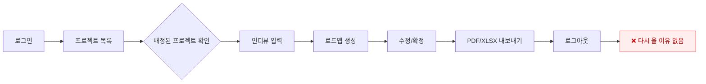
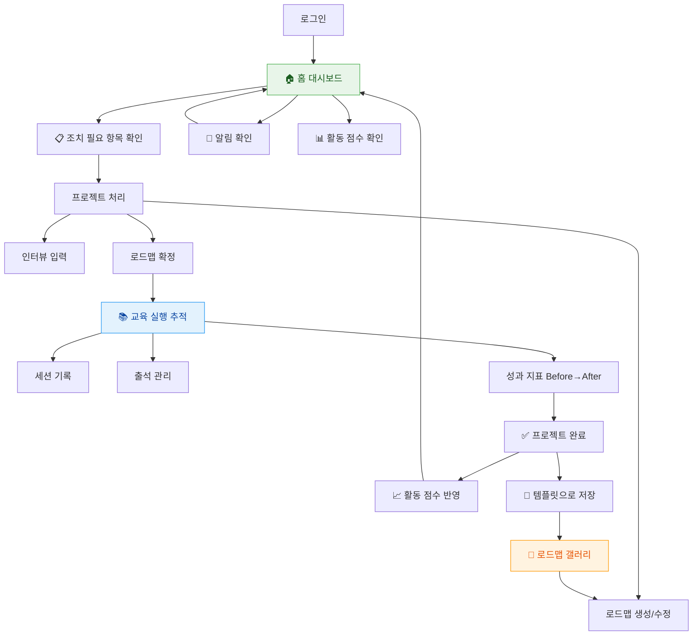
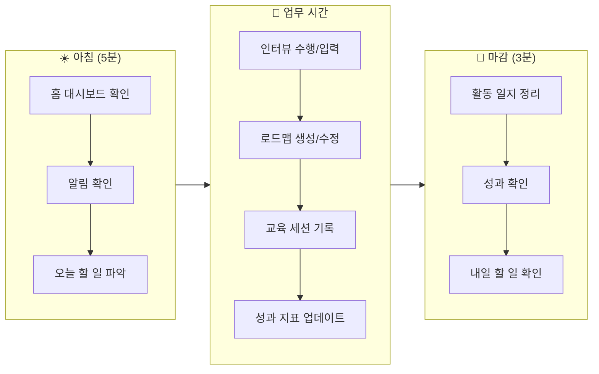
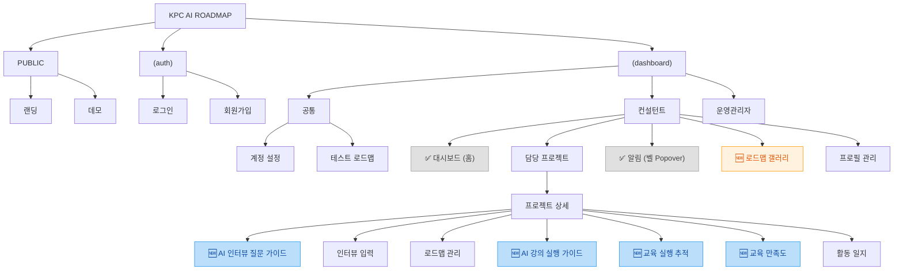
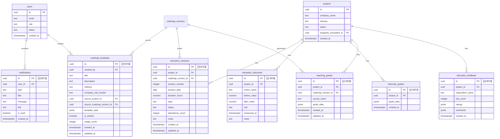

# 컨설턴트 인게이지먼트 향상 제안서

> KPC AI 훈련 로드맵 대시보드 — 컨설턴트 체류 시간, 재방문율, 실용성 극대화를 위한 기능 제안

---

## 1. 현재 상태 요약

### 1.1 현재 컨설턴트 기능 목록

| 기능 | 경로 | 설명 |
|------|------|------|
| 담당 프로젝트 목록 | `/consultant/projects` | 검색/필터 + 프로젝트 카드 |
| 프로젝트 상세 | `/consultant/projects/[id]` | 기업 정보, 자가진단, 활동 일지 |
| 인터뷰 입력 | `/consultant/projects/[id]/interview` | 6단계 스텝 폼, 자동저장, STT |
| 로드맵 관리 | `/consultant/projects/[id]/roadmap` | AI 생성, 수정, 확정, 내보내기 |
| 프로필 관리 | `/consultant/profile` | 전문 분야, 경력, 산업 경험 |
| 테스트 로드맵 | `/test-roadmap` | 연습용 로드맵 생성 |

### 1.2 핵심 문제

현재 시스템은 **"프로젝트 완료 도구"**로만 기능하며, 컨설턴트의 사용 패턴은 아래와 같은 **일방향 파이프라인**입니다:

```
프로젝트 배정 → 인터뷰 입력 → 로드맵 생성 → 확정/내보내기 → ❌ 끝 (다시 올 이유 없음)
```

### 1.3 없는 것 (재방문 동기 관점)

- ✅ **홈 대시보드**: 구현 완료 (`/consultant/home`) — KPI 카드, 상태 분포 차트, 최근 프로젝트, 최근 활동
- ✅ **알림 시스템**: 구현 완료 — NotificationBell + Realtime 구독 + 안읽음 뱃지
- ✅ **메시징 시스템**: 구현 완료 — MessageIcon + 실시간 채팅 (`/dashboard/messages`)
- ❌ **교육 후 추적**: FINALIZED 후 교육 진행/성과 추적 없음
- ❌ **AI 인터뷰 가이드**: 자가진단 기반 맞춤 질문 자동 생성 없음
- ❌ **AI 강의 가이드**: 확정 로드맵 기반 교안/가이드 생성 없음
- ❌ **교육 만족도**: 교육생 피드백 수집 없음
- ❌ **지식 재활용**: 과거 로드맵 검색/템플릿 기능 없음

---

## 2. 리서치 인사이트

### 2.1 B2B SaaS / 프로젝트 관리 도구

| 서비스 | 핵심 재방문 메커니즘 | 우리 시스템에의 시사점 |
|--------|---------------------|----------------------|
| **Salesforce** Pipeline Inspection | AI 기반 거래 건강도 색상 코딩, 주간 변화 자동 추적 | 프로젝트 건강도 점수 (빨/노/초) |
| **HubSpot** Customer Success Workspace | 일일 To-Do 리스트, 건강도 점수, 자동 리마인더 | 홈 대시보드의 "조치 필요 항목" |
| **Asana** My Tasks + Inbox | 모든 프로젝트의 할당 작업을 한 곳에서 확인 | 컨설턴트 홈의 통합 뷰 |
| **Jira** Automation | 평일마다 예약 알림, 스프린트 번다운 차트 | 마감일 알림 + 진행률 시각화 |
| **Linear** | Slack 중심 간소화된 알림, 빠른 인터페이스 | 간결한 인앱 알림 센터 |
| **Monday.com** Recents Tab | 자주 사용하는 항목 빠른 접근, 컨텍스트 인식 UI | 홈 대시보드의 "최근 활동" |
| **Pipedrive** Sales Assistant | 항상 켜진 사이드 패널, 최근 접촉 없는 거래 플래그 | "7일간 업데이트 없음" 알림 |

### 2.2 교육/LMS 플랫폼

| 서비스 | 핵심 메커니즘 | 시사점 |
|--------|-------------|--------|
| **Coursera** Skills Dashboard | 스킬 숙련도 시간 경과 추적, 갭 식별 | 교육 성과 Before/After 추적 |
| **Udemy Business** Analytics | 그룹별 세분화 참여 분석, 인기 콘텐츠 발견 | 로드맵 사용 통계 |
| **Skillsoft** My Dashboard | To Do List + 권장 액션 제안, 다중 대시보드 | 홈의 "오늘 해야 할 일" + "권장 조치" |
| **LinkedIn Learning** | 관리자가 참여도의 70% 결정 (Gallup), 역할별 추천 | 컨설턴트 = 교육 관리자 역할 전환 |

### 2.3 게이미피케이션 / 인게이지먼트

| 서비스 | 핵심 패턴 | 검증된 효과 | 적용 방안 |
|--------|----------|-----------|----------|
| **Duolingo** Streak | 연속 학습 일수, Freeze 메커니즘 | 7일 스트리크 유지 시 장기 참여 **3.6배** ↑ | 개인 활동 스트리크 (선택적) |
| **GitHub** Contribution Graph | 12개월 활동 히트맵, "빈 칸 채우기" 욕구 | 시각적 동기 부여 | 활동 히트맵 (성과 대시보드) |
| **LinkedIn** SSI | 4개 차원 0~100점, 일일 업데이트 | SSI 70점 이상 → 영업 기회 **45%** ↑ | 컨설턴트 활동 점수 (장기) |
| **Notion** Template Gallery | 5,000+ 템플릿, 크리에이터 프로필 | 연간 5,100만 복제 | 로드맵 템플릿 갤러리 |

### 2.4 핵심 트렌드 (2025-2026)

1. **Decision Intelligence**: 정적 대시보드 → 동적 액션 가능한 인사이트
2. **멀티채널 알림**: 세분화 + 개인화 시 CTR **218%** 증가
3. **게이미피케이션 ROI**: 적절한 적용 시 전환율 **7배**, 사용자 참여 **40%** ↑
4. **실시간 데이터**: 색상 코드 상태 표시, 임계값 알림, 자동 넛지
5. **간결함의 원칙**: "설명이 필요하면 너무 복잡한 것"

---

## 3. 사용자 플로우 비교 (Before / After)

### 3.1 Before: 현재 플로우



### 3.2 After: 개선 후 플로우



### 3.3 컨설턴트의 하루 시나리오 (After)



---

## 4. 기능 제안 목록

### 4.1 우선순위 요약표

| # | 기능명 | 참고 사례 | 난이도 | 버전 | 재방문 유도력 | 상태 |
|---|--------|----------|--------|------|-------------|------|
| 1 | **컨설턴트 홈 대시보드** | Asana My Tasks, HubSpot CSW, Skillsoft | M | — | ★★★★★ | ✅ 완료 |
| 2 | **인앱 알림 + 메시징** | GitHub, Linear, Asana, HubSpot | M | — | ★★★★☆ | ✅ 완료 |
| 3 | **AI 인터뷰 질문 가이드** | HubSpot AI Meeting Assistant, Salesforce Client Meeting Prep | M | 베타 | ★★★★☆ | 미착수 |
| 4 | **AI 강의 실행 가이드** | DISCO AI Curriculum, EdCafe AI, LessonPlanLM | M | 베타 | ★★★★★ | 미착수 |
| 5 | **로드맵 템플릿 라이브러리** | Notion Template Gallery | M | 베타 | ★★★☆☆ | 미착수 |
| 6 | **컨설턴트 활동 점수** | LinkedIn SSI, Duolingo Streak | M | 베타 | ★★★☆☆ | 미착수 |
| 7 | **교육 실행 추적** | Coursera Skills Dashboard, LMS 전반 | L | 정식 | ★★★★★ | 미착수 |
| 8 | **교육 만족도 수집** | Kirkpatrick Level 1, ProProfs Survey | S | 정식 | ★★★☆☆ | 미착수 |

**보류:**

| 기능명 | 사유 |
|--------|------|
| 프로젝트 마감일 관리 | 필요 시 구현 예정 (projects 컬럼 추가, D-day 표시) |

### 4.2 기능 상세

---

#### P0-1. 컨설턴트 홈 대시보드 ✅ 구현 완료

> **"매일 여는 이유"를 만드는 관문(Gateway)**

**상태: ✅ 구현 완료** — `/consultant/home`에서 실제 동작 중

**실제 구현 내용:**
- 환영 메시지 (로그인 사용자 이름 + 날짜)
- KPI 요약 카드 4개: 전체 프로젝트 / 인터뷰 대기 / 진행 중 / 완료
- 상태 분포 도넛 차트 (Recharts)
- 최근 프로젝트 5개 (상태 배지 + 기업명)
- 최근 활동 기록 5개 (`consultant_activity_logs` 테이블에서 조회)
- 네비게이션에 "대시보드" 메뉴 추가 완료

**원래 제안 대비 차이:**
- 제안의 "조치 필요 항목" 및 "마감일 배지"는 미포함 (마감일 관리는 보류 상태)
- 전체적인 구성과 목적은 제안과 동일

---

#### P1-1. 인앱 알림 + 메시징 ✅ 구현 완료

> **"시스템이 나를 부른다" — 재방문 트리거**

**상태: ✅ 구현 완료** — NotificationBell + MessageIcon + Realtime 구독

**한 줄 요약:** 네비게이션 우상단 벨 아이콘을 클릭하면 알림 패널이 열리는 기능 + 실시간 메시징

**참고 사례:**
- GitHub Notifications — 벨 아이콘 + 드롭다운 + 안읽음 파란 도트
- Linear Inbox — 벨 아이콘 + 사이드 패널, 간결한 알림
- Asana Inbox — 벨 아이콘 + Popover, "전체 보기" 링크
- HubSpot Notifications — 벨 아이콘 + 피드 형태 Popover

**Best Practice (리서치 결과):**

| 원칙 | 설명 | 출처 |
|------|------|------|
| **Progressive Disclosure** | 메인 워크플로우를 방해하지 않고 빠르게 확인 | Toptal, SetProduct |
| **시각적 신호** | 안읽음 뱃지(빨간 숫자)가 "확인해야 할 것이 있다"는 재방문 유도 | UserPilot |
| **하이브리드 접근** | Popover(빠른 확인) + 전체 페이지(히스토리)가 B2B 표준 | MagicBell |
| **비모달(Non-modal)** | Popover는 바깥 클릭으로 닫힘, 사용자를 가두지 않음 | Carbon Design |
| **Lazy Loading** | 벨 아이콘 클릭 시에만 알림 데이터 fetch → 초기 로드 영향 없음 | - |

**컨설턴트 가치:**
새 프로젝트 배정, 마감 임박, 운영관리자 메시지 등을 놓치지 않음. 벨 아이콘의 빨간 뱃지가 "확인해야 할 것이 있다"는 신호를 보내 시스템 재방문 유도. 별도 페이지 이동 없이 현재 작업 중에 빠르게 확인 가능.

**홈 대시보드의 "최근 활동"과의 차이:**

| 구분 | 최근 활동 (홈 대시보드) | 알림 (이 기능) |
|------|----------------------|--------------|
| **비유** | 내 업무일지 | 카톡/이메일 알림함 |
| **방향** | 나 → 시스템 (내가 기록) | 시스템 → 나 (시스템이 알려줌) |
| **생성 주체** | 컨설턴트 본인이 직접 작성 | 시스템이 자동 생성 |
| **내용 예시** | "OO기업 사전조사 완료", "현장메모 작성" | "새 프로젝트 배정됨", "마감 3일 전" |
| **읽음 관리** | 없음 | 있음 (읽음/안읽음 + 뱃지) |
| **데이터** | `consultant_activity_logs` (기존) | `notifications` (신규) |
| **핵심 목적** | "내가 최근에 한 일" 확인 | "내가 해야 할 일" 알림 |

> 정리: 활동 기록은 **과거 행위 로그**이고, 알림은 **미래 행동 트리거**입니다. 둘은 방향이 정반대이며 서로 보완적입니다.

**UI 구성 — 벨 아이콘 + Popover 패널:**

```
네비게이션 바 (변경):
[로고] [대시보드] [담당 프로젝트] [테스트 로드맵] [로드맵 갤러리] ··· [🔔₃] [👤 유저메뉴]
                                                        ↓ 클릭 시 Popover 열림

┌─────────────────────────────────────┐  ← 너비: 380px
│  알림                    모두 읽음   │  ← 헤더 (고정, 스크롤 안 됨)
├─────────────────────────────────────┤
│                                     │
│  🔵 새 프로젝트 배정                 │  ← 안읽음: 좌측 파란 도트
│     (주)한국전자 프로젝트가           │
│     배정되었습니다.                   │
│     30분 전                         │
│  ─────────────────────────────────  │
│  🔵 마감 임박                        │
│     삼성물산(주) 로드맵 확정          │
│     마감이 5일 남았습니다.            │
│     1시간 전                        │
│  ─────────────────────────────────  │
│  ○ 프로젝트 상태 변경               │  ← 읽음: 도트 없음, 투명도 낮춤
│     LG에너지솔루션 프로젝트가         │
│     "교육 진행중"으로 변경            │
│     어제                            │
│  ─────────────────────────────────  │
│  ○ 로드맵 생성 완료                 │
│     삼성물산(주) 로드맵 v2가         │
│     성공적으로 생성되었습니다.         │
│     어제                            │
│                                     │  ← 최대 높이: 480px, 초과 시 스크롤
├─────────────────────────────────────┤
│          전체 알림 보기 →            │  ← 푸터 (향후 전체 페이지 연결)
└─────────────────────────────────────┘
```

**Popover 패널 상세 스펙:**

| 항목 | 스펙 |
|------|------|
| 너비 | `w-[380px]` (모바일: 전체 화면) |
| 최대 높이 | `max-h-[480px]` → 내부 스크롤 |
| 위치 | 벨 아이콘 아래, 우측 정렬 (`align="end"`) |
| 열기/닫기 | shadcn/ui Popover (Radix UI 기반, 바깥 클릭 자동 닫힘) |
| 헤더 | "알림" 제목 + "모두 읽음" 버튼 (고정, 스크롤 안 됨) |
| 알림 항목 | 타입 아이콘 + 제목 + 내용 미리보기(1줄) + 상대 시간 |
| 안읽음 표시 | 좌측 파란 도트 (`bg-blue-500`) + 배경 `bg-blue-50/30` |
| 읽음 처리 | 알림 클릭 시 자동 읽음 + 해당 페이지로 이동 |
| 빈 상태 | "새로운 알림이 없습니다" + 벨 아이콘 |
| 푸터 | "전체 알림 보기 →" 링크 (향후 전체 페이지 추가 시 활성화) |
| 뱃지 | 벨 아이콘 우상단, 빨간 원 + 흰 숫자 (`9+` 처리) |

**알림 타입별 아이콘:**

| 타입 | 아이콘 | 배경색 | 예시 |
|------|--------|--------|------|
| `assignment` (배정) | `Briefcase` | `bg-blue-50` | 새 프로젝트 배정 |
| `deadline` (마감) | `AlertTriangle` | `bg-amber-50` | 마감 D-3, D-1 |
| `status_change` (상태) | `CheckCircle2` | `bg-green-50` | 상태 변경 알림 |
| `message` (메시지) | `MessageSquare` | `bg-purple-50` | 운영관리자 코멘트 |
| `system` (시스템) | `FileText` | `bg-gray-50` | 로드맵 생성 완료 |

**구현 개요:**
- 새 테이블: `notifications` (id, user_id, type, title, message, link, is_read, created_at)
- 컴포넌트: `NotificationBell` (벨 아이콘 + 뱃지) + `NotificationPopover` (패널 내용)
- 위치: `Navigation.tsx`의 유저 드롭다운 좌측에 벨 아이콘 추가
- 데이터 로딩: 벨 아이콘 클릭 시 Lazy Fetch (초기 로드 영향 없음)
- Server Action에서 이벤트 발생 시 알림 INSERT (배정, 상태 변경, 마감 D-3/D-1)
- 안읽음 카운트: 레이아웃에서 서버 사이드로 카운트만 전달 (뱃지 표시용)
- 전체 페이지: 초기에는 미구현 (YAGNI), 향후 필요 시 `/consultant/notifications` 추가

**목업:** `/proposals/notifications` 에서 전체 페이지 형태의 참고 목업 확인 가능

---

#### P1-2. 교육 실행 추적 (Post-Delivery Tracking)

> **"완료 후에도 가치" — 가장 강력한 재방문 이유**

**한 줄 요약:** 로드맵 확정 후, 실제 교육 진행 상황과 성과를 기록하고 추적하는 기능

**쉬운 설명:**

현재 시스템의 워크플로우는 `인터뷰 → 로드맵 생성 → 확정 → [여기서 끝!]`입니다. 하지만 실제로는 확정된 로드맵대로 **8회차 교육을 진행**합니다. 이 교육 과정을 시스템에서 관리하는 것이 이 기능입니다.

비유하면:
- 로드맵 생성 = **여행 계획 세우기**
- 교육 실행 추적 = **실제 여행하면서 일기 쓰기 + 사진 찍기**

구체적으로 뭘 하나?
1. **세션 관리**: "1회차(1/13): AI 품질검사 개론 — 5시간 — 출석 12/15명 — 완료"
2. **진행률 확인**: "8회차 중 5회차 완료 (62.5%)"
3. **성과 추적 (Before → After)**:
   - 교육 전 불량 검출 시간 45분/건 → 교육 후 12분/건 (73% 개선)
   - 교육 전 검사 정확도 82% → 교육 후 94% (15% 개선)

왜 이게 중요한가?
- 컨설턴트가 로드맵 확정 후에도 **시스템에 돌아와야 하는 가장 강력한 이유**
- 교육의 실질적 효과를 **수치로 증명** → 보고서/포트폴리오에 직결
- 프로젝트 상태를 `FINALIZED → DELIVERING → COMPLETED`로 확장하여 생명주기 완성

**참고 사례:**
- Coursera "Skills Development Dashboard" — 스킬 숙련도 시간 경과 추적
- Udemy Business "Adoption Dashboard" — 학습 채택률 및 참여 트렌드
- Skillsoft "Certification Dashboard" — 인증 프로그램 성과, 트렌드, 완료율

**화면 구성:**
- 진행률 프로그레스바 (시간/회차 기준)
- KPI 카드: 완료 회차, 평균 출석, 남은 시간, 다음 세션
- 교육 세션 목록: 회차별 주제, 출석, 상태 (완료/예정/취소)
- 성과 지표 Before→After: 인터뷰 시 설정한 KPI 대비 개선률 시각화

**구현 개요:**
- 프로젝트 상태 확장: `FINALIZED → DELIVERING → COMPLETED`
- 새 테이블 2개:
  - `education_sessions` (id, project_id, session_number, session_date, topic, status, attendance, notes)
  - `education_outcomes` (id, project_id, metric_name, before_value, after_value, unit, measured_at)
- 라우트: `/consultant/projects/[id]/delivery`

**목업:** `/proposals/delivery` 에서 확인 가능

---

#### P1-3. AI 인터뷰 질문 가이드

> **"진단 데이터가 질문을 만든다" — 컨설턴트의 전문성을 AI가 증폭**

**한 줄 요약:** 자가진단 결과를 AI가 분석하여, 컨설턴트가 현장 인터뷰에서 물어볼 맞춤 질문 리스트를 자동 생성

**쉬운 설명:**

현재 컨설턴트는 자가진단 결과를 직접 읽고 어떤 질문을 할지 스스로 준비합니다. 이 기능은 자가진단 5영역 30문항의 점수와 답변을 AI가 분석하여 "이 기업은 데이터 준비도가 낮으니 이런 질문을 하세요"라는 맞춤형 가이드를 제공합니다.

비유하면:
- 자가진단 = **건강 검진 결과표**
- AI 질문 가이드 = **의사가 검진 결과를 보고 정밀 검사 항목을 정해주는 것**

**참고 사례:**
- HubSpot "AI Meeting Assistant" — 과거 이메일·딜 데이터를 분석해 미팅 전 "Pain Points & Opportunities" 자동 생성
- Salesforce "Client Meeting Prep" — 클라이언트 프로필(케이스, 인터랙션) AI 요약 → 미팅 준비 자료 생성

**컨설턴트 가치:**
인터뷰 전 준비 시간 단축. 자가진단의 약한 영역을 놓치지 않고 체계적으로 파고듦. "이 시스템이 나를 도와준다"는 경험.

**UI 구성:**
- 위치: 프로젝트 상세 페이지 → "인터뷰 준비 가이드" 버튼 (자가진단 완료 후 활성화)
- 출력 형태: 카드/섹션 형태
  1. 기업 현황 요약 (2~3문장)
  2. 영역별 핵심 파악 포인트 (약한 영역 우선)
  3. 추천 질문 리스트 (영역별 2~3개, 총 10~15개)
  4. 인터뷰 시 주의사항

**구현 개요:**
- 입력: 자가진단 5영역 점수 + 30개 답변 + 기업 기본정보 (업종, 규모)
- LLM 호출 1회 (기존 `llm.ts` + `quota.ts` 재활용)
- 라우트: 별도 페이지 없음 (프로젝트 상세 내 섹션 또는 모달)
- 저장: `interview_guides` 테이블 또는 프로젝트 메타데이터에 JSON 저장
- 새 테이블: `interview_guides` (id, project_id, guide_data JSONB, created_at)

---

#### P1-4. AI 강의 실행 가이드

> **"로드맵이 '무엇을', 이것이 '어떻게'" — 교육 실행의 마지막 퍼즐**

**한 줄 요약:** 확정된 로드맵의 과정 데이터를 기반으로, 과정별 상세 커리큘럼·교안·강의 진행 가이드를 AI가 자동 생성

**쉬운 설명:**

로드맵에는 이미 과정별 모듈명·시간·내용·실습이 있지만, 이것은 "무엇을 가르칠지"입니다. 이 기능은 "어떻게 가르칠지"를 생성합니다.

비유하면:
- 로드맵 = **여행 일정표** (어디를 갈지)
- 강의 가이드 = **여행 가이드북** (각 장소에서 뭘 하고, 어떻게 이동하고, 뭘 주의할지)

**참고 사례:**
- DISCO AI Curriculum Generator — 프롬프트 기반 전체 커리큘럼 + 레슨 + 과제 + 퀴즈 자동 생성
- EdCafe AI Lesson Plan — 토픽/문서 → 목표·교재·활동·평가 포함 레슨 플랜 자동 생성
- LessonPlanLM (학술 연구) — LLM + 지식베이스 → 표준화된 단계별 레슨 플랜 생성

**컨설턴트 가치:**
로드맵 확정 후에도 시스템을 사용하는 강력한 이유. 강의 준비 시간 대폭 단축. 교육 품질 표준화.

**UI 구성:**
- 위치: 로드맵 확정 후, 프로젝트 상세 → "강의 가이드 생성" 버튼
- 출력 형태 (과정 내 모듈별):
  1. 세션 개요 (학습 목표, 소요 시간, 준비물)
  2. 시간별 진행 가이드 (도입 → 전개 → 정리)
  3. 실습 진행 시나리오
  4. 체크포인트 / 평가 기준
  5. 강사 참고 TIP
- PDF 내보내기 지원 (기존 `jspdf` 인프라 활용)

**구현 개요:**
- 입력: 확정된 로드맵의 PBL 과정 데이터 (modules, hours, practice, tools, deliverables)
- LLM 호출: 과정당 1회 (기존 인프라 재활용)
- 라우트: `/consultant/projects/[id]/teaching-guide`
- 새 테이블: `teaching_guides` (id, project_id, roadmap_version_id, course_name, guide_data JSONB, created_at, updated_at)

**범위 조절:**
전체 PPT/교안 자동 생성은 범위가 너무 큼. "강의 실행 가이드" (텍스트 기반 진행 가이드 + PDF 내보내기) 수준이 현실적.

---

#### P1-5. 교육 만족도 수집

> **"교육의 마침표" — Kirkpatrick Level 1 평가**

**한 줄 요약:** 교육 완료 후 기업 교육생으로부터 만족도와 피드백을 수집하는 설문 기능

**쉬운 설명:**

교육이 끝나면 교육생들에게 "교육이 어떠셨나요?"를 물어보는 기능입니다. Kirkpatrick 교육 평가 모델의 Level 1(Reaction)에 해당합니다. Level 4(Results)는 교육 추적의 Before→After 성과 지표로 이미 커버됩니다.

**참고 프레임워크:**
- Kirkpatrick 4단계 모델 — Level 1(만족도 반응)이 교육 평가의 출발점
- ProProfs Survey Best Practice — NPS + 리커트 + 자유응답 조합, 5~10문항, 모바일 친화적

**컨설턴트 가치:**
교육 품질을 객관적 수치로 확인. 만족도 데이터가 컨설턴트 포트폴리오에 반영. 개선 의견으로 다음 교육 품질 향상.

**설문 구조 (7문항):**

| # | 항목 | 형식 |
|---|------|------|
| 1 | "이 교육을 동료에게 추천하시겠습니까?" | NPS (0~10) |
| 2 | 교육 내용의 적절성 | 5점 리커트 |
| 3 | 강사의 전문성 | 5점 리커트 |
| 4 | 실습의 유용성 | 5점 리커트 |
| 5 | 업무 적용 가능성 | 5점 리커트 |
| 6 | 가장 유용했던 내용 | 자유응답 |
| 7 | 개선 의견 | 자유응답 |

**구현 개요:**
- 위치: 교육 추적 페이지 내, 교육 완료 후 "만족도 조사" 버튼 활성화
- 공개 URL 방식: 교육생이 로그인 없이 접근 가능한 설문 링크 생성
- 결과: 교육 추적 페이지에 NPS 점수 + 항목별 평균 + 응답 목록 표시
- 새 테이블: `education_feedback` (id, project_id, respondent_name, nps_score, ratings JSONB, comments JSONB, created_at)

---

#### P2-1. 로드맵 템플릿 라이브러리

> **"시간 절약 + 품질 향상" — 지식 자산 축적**

**한 줄 요약:** 잘 만든 로드맵을 "틀(템플릿)"로 저장해서, 비슷한 프로젝트에서 재활용하는 기능

**쉬운 설명:**

파워포인트 템플릿과 동일한 개념입니다. 컨설턴트가 "전자/반도체 품질검사 AI 교육" 로드맵을 잘 만들었으면, 이걸 템플릿으로 저장해둡니다. 다음에 비슷한 업종의 기업이 오면 **처음부터 안 만들고 템플릿에서 시작**하여 기업 맞춤형으로만 수정합니다.

추가로:
- **내 템플릿**: 내가 만든 것
- **공유 템플릿**: 다른 컨설턴트가 공유한 것 (Notion 템플릿 갤러리처럼)
- "이 템플릿이 5번 사용되었습니다"라는 사회적 증거가 동기 부여

**참고 사례:**
- Notion "Template Gallery" — 5,000+ 템플릿, 크리에이터 프로필, 연간 5,100만 복제

**구현 개요:**
- 새 테이블: `roadmap_templates` (id, created_by, title, description, industry, template_data JSONB, is_shared, usage_count)
- 라우트: `/consultant/templates`
- 로드맵 생성 시 "템플릿에서 시작" 옵션 추가

**목업:** `/proposals/templates` 에서 확인 가능

---

#### P2-2. 컨설턴트 활동 점수

> **"성장 동기" — 내가 얼마나 잘하고 있는지**

**참고 사례:**
- LinkedIn "SSI Score" — 4개 차원, 0~100점
- Duolingo "Streak" — 연속 활동 일수

**컨설턴트 가치:**
4개 차원 (프로필 완성도, 프로젝트 참여, 로드맵 품질, 후속관리)으로 분해된 점수가 개선 방향을 제시. 주간 점수 변화가 동기 부여.

**구현 개요:**
- 성과 대시보드에 "활동 점수" 섹션 추가
- 4개 차원별 25점씩, 총 100점
- 계산 로직: 프로필 필드 완성률, 활동 빈도, 로드맵 수정 횟수, 교육 추적 완성도
- 새 테이블: 불필요 (기존 데이터로 계산)

---

## 5. 정보 구조도

### 5.1 전체 사이트맵 (신규 기능 위치 포함)



**범례:**
- ⬜ 회색: ✅ 구현 완료
- 🔵 파랑: 베타 (다음 구현 대상)
- 🟠 주황: 베타 (장기)

### 5.2 네비게이션 변경

**접근법: 역할별 혼합 — 컨설턴트는 플랫, 관리자는 그룹 드롭다운**

컨설턴트는 메뉴가 4개뿐이므로 플랫(일렬) 배치가 최적입니다.
관리자는 메뉴가 7~8개로 많아지므로, 그룹 드롭다운(Vercel/HubSpot 스타일)으로 묶습니다.

#### 베타 버전 네비게이션

```
컨설턴트 (플랫 4개):
[로고]  대시보드  담당 프로젝트  테스트 로드맵  로드맵 갤러리  ···  [💬] [🔔] [👤]

운영관리자 / 시스템관리자 (드롭다운 3그룹):
[로고]  워크스페이스 ▾  운영관리 ▾  라이브러리 ▾  ···········  [💬] [🔔] [👤]
         ├ 프로젝트 관리   ├ 사용자 관리   ├ 로드맵 갤러리
         └ 테스트 로드맵   ├ 쿼터 관리     └ 자가진단 템플릿
                          └ 감사로그
```

**설계 근거:**
- 컨설턴트는 매일 사용하는 주 사용자 → 클릭 수 최소화가 중요 → 플랫이 최적
- 관리자는 메뉴 7개 이상 → 플랫 시 가로 공간 부족 → 3그룹 드롭다운 필요
- 운영관리자와 시스템관리자는 동일 메뉴 (자가진단 템플릿도 운영관리자 접근 가능)

**그룹명 의미:**
| 그룹 | 성격 | 포함 항목 |
|------|------|----------|
| 워크스페이스 | 진행 중인 업무 | 프로젝트 관리, 테스트 로드맵 |
| 운영관리 | 시스템 운영 | 사용자 관리, 쿼터 관리, 감사로그 |
| 라이브러리 | 참고 자료 / 산출물 | 로드맵 갤러리, 자가진단 템플릿 |

#### 정식 버전 네비게이션 (교육 추적 추가)

교육 실행 추적·만족도 수집 기능이 추가됩니다. 교육 관련 기능은 프로젝트 상세 페이지의 하위 탭으로 구현되므로, 컨설턴트의 플랫 구조는 그대로 유지됩니다.

```
컨설턴트 (플랫 — 베타와 동일):
[로고]  대시보드  담당 프로젝트  테스트 로드맵  로드맵 갤러리  ···  [💬] [🔔] [👤]

운영관리자 / 시스템관리자 (드롭다운 — 베타와 동일):
[로고]  워크스페이스 ▾  운영관리 ▾  라이브러리 ▾  ···········  [💬] [🔔] [👤]
         ├ 프로젝트 관리   ├ 사용자 관리   ├ 로드맵 갤러리
         └ 테스트 로드맵   ├ 쿼터 관리     └ 자가진단 템플릿
                          └ 감사로그
```

> 정식 버전에서도 네비게이션 구조는 변경 없음. 교육 실행 추적·만족도는 프로젝트 상세 내부에서 접근.

> 알림(🔔)과 메시지(💬)는 별도 메뉴 항목이 아니라, **네비게이션 우측 영역에 아이콘**으로 배치.
> AI 기능(인터뷰 질문 가이드, 강의 실행 가이드)과 교육 만족도는 프로젝트 상세 내부 기능이므로 상단 네비게이션에 표시하지 않음.

---

## 6. 데이터 모델

### 6.1 ERD (신규 테이블 + 기존 연결)



### 6.2 기존 테이블 변경 사항

| 테이블 | 변경 | 설명 |
|--------|------|------|
| `projects` | status 값 추가 | `DELIVERING`, `COMPLETED` 추가 |

### 6.3 새 테이블 요약

| 테이블 | 버전 | 설명 |
|--------|------|------|
| `notifications` | — | 인앱 알림 (타입별 관리) — ✅ 구현됨 |
| `interview_guides` | 베타 | AI 인터뷰 질문 가이드 (JSON) |
| `teaching_guides` | 베타 | AI 강의 실행 가이드 (과정별 JSON) |
| `roadmap_templates` | 베타 | 로드맵 템플릿 (공유/검색) |
| `education_sessions` | 정식 | 교육 세션 기록 (회차, 출석, 메모) |
| `education_outcomes` | 정식 | 교육 성과 지표 (Before/After) |
| `education_feedback` | 정식 | 교육 만족도 설문 (NPS + 리커트 + 자유응답) |

---

## 7. 구현 로드맵

### 완료된 작업

| 작업 | 설명 | 상태 |
|------|------|------|
| 컨설턴트 홈 대시보드 | KPI 카드, 상태 차트, 최근 프로젝트, 최근 활동 | ✅ 완료 |
| 인앱 알림 + 메시징 | NotificationBell, MessageIcon, Realtime 구독, 알림 테이블 | ✅ 완료 |
| 네비게이션 업데이트 | "대시보드" 메뉴 추가, 알림/메시지 아이콘 추가 | ✅ 완료 |

### 베타 버전

> **목표: AI 보조 기능 + 지식 자산 축적**

| 작업 | 설명 | 공수 |
|------|------|------|
| 네비게이션 개편 | 컨설턴트 플랫 4개 + 관리자 드롭다운 3그룹 (워크스페이스·운영관리·라이브러리), 자가진단 템플릿 운영관리자 접근 추가 | 2~3일 |
| AI 인터뷰 질문 가이드 | 프롬프트 설계, LLM 호출, 가이드 UI | 3~4일 |
| AI 강의 실행 가이드 | 프롬프트 설계, 과정별 가이드 생성, PDF 내보내기 | 5~7일 |
| 로드맵 템플릿 | 테이블, 저장/검색/사용 기능, 갤러리 UI | 5~7일 |
| 컨설턴트 활동 점수 | 4차원 점수 계산, 대시보드에 통합 | 3~4일 |

### 정식 버전

> **목표: 교육 실행 후 추적 + 피드백 수집**

| 작업 | 설명 | 공수 |
|------|------|------|
| 교육 실행 추적 | 3개 테이블, 세션 CRUD, 성과 지표 입력, 진행률 UI | 5~7일 |
| 교육 만족도 수집 | 설문 폼, 공개 URL, 결과 집계 (교육 추적과 세트) | 2~3일 |

---

## 8. 기대 효과

### 이미 달성된 효과 (완료된 기능)

| 지표 | 이전 | 현재 |
|------|------|------|
| 일 평균 방문 빈도 | 프로젝트 있을 때만 | **매일 1회 이상** (홈 대시보드 + 알림) |
| 로그인 후 첫 액션까지 시간 | 목록 탐색 → 느림 | **즉시** (홈에서 직접 이동) |
| 프로젝트 누락 | 가끔 발생 | **알림으로 즉시 인지** |
| 팀 커뮤니케이션 | 외부 채널 필요 | **인앱 메시징으로 해결** |

### 베타 버전 완료 시

| 지표 | 현재 대비 | 추가 개선 |
|------|----------|----------|
| 인터뷰 준비 시간 | 수동 분석 | **AI 가이드로 대폭 단축** |
| 강의 준비 시간 | 수동 교안 작성 | **AI 가이드로 대폭 단축** |
| 로드맵 생성 시간 | 30분~1시간 | **템플릿 활용 시 50% 단축** |
| 컨설턴트 간 협업 | 없음 | **템플릿 공유로 간접 협업** |
| 장기 동기 부여 | 단기적 | **활동 점수로 지속적** |

**컨설턴트 경험 변화:**
> "AI가 인터뷰 질문과 강의 가이드를 준비해주니 전문성이 한층 올라간다. 비슷한 업종의 프로젝트를 받으면 과거 템플릿에서 시작할 수 있어 시간이 절반으로 줄었다."

### 정식 버전 완료 시

| 지표 | 베타 대비 | 추가 개선 |
|------|----------|----------|
| FINALIZED 후 방문 | 없음 | **주 2~3회** (교육 세션 기록) |
| 교육 효과 증명 | 정성적 | **Before→After 수치화** |
| 교육 품질 피드백 | 없음 | **NPS + 리커트 만족도 데이터** |

**컨설턴트 경험 변화:**
> "교육 진행 상황과 성과를 추적할 수 있다. Before→After 데이터가 쌓이니 교육의 실질적 효과를 증명할 수 있다. 교육생 만족도까지 수집되니 포트폴리오가 강화된다."

---

## 부록: 목업 접근 경로

개발 서버에서 아래 경로로 목업을 확인할 수 있습니다:

| 기능 | 목업 경로 | 실제 경로 | 상태 |
|------|----------|----------|------|
| 홈 대시보드 | `/proposals/home` | `/consultant/home` | ✅ 구현됨 |
| 알림 (벨 Popover) | `/proposals/notifications` | Navigation 내 NotificationBell | ✅ 구현됨 |
| 교육 실행 추적 | `/proposals/delivery` | — | 미착수 (P1) |
| 템플릿 라이브러리 | `/proposals/templates` | — | 미착수 (P2) |

> 목업은 하드코딩된 데모 데이터를 사용하는 정적 페이지입니다. 실제 구현 시 Server Actions와 Supabase 연동이 필요합니다.

---

## 참고 자료 (Sources)

### B2B SaaS / 프로젝트 관리
- [Salesforce Pipeline Inspection Guide](https://www.salesforceben.com/ultimate-guide-to-salesforce-pipeline-inspection/)
- [HubSpot Customer Health Score](https://knowledge.hubspot.com/help-desk/customize-a-health-score-in-the-customer-success-workspace)
- [Asana Work Tracking Features](https://asana.com/features)
- [Jira Project Management 2026](https://everhour.com/blog/jira-project-management/)
- [Monday.com January 2026 Updates](https://www.dsapps.dev/blog/monday-dot-com-january-2026-updates/)
- [Pipedrive CRM Review](https://www.folk.app/articles/pipedrive-crm-review)

### 교육/LMS
- [Coursera Skills Development Dashboard](https://blog.coursera.org/coursera-for-business-releases-skills-development-dashboards-to-measure-learning-outcomes/)
- [Udemy Business Analytics](https://business.udemy.com/analytics/)
- [Skillsoft My Dashboard](https://documentation.skillsoft.com/en_us/percipio/Content/A_Administrator/admn_dashboard_home.htm)
- [LinkedIn Learning Engagement Playbook](https://learning.linkedin.com/resources/learner-engagement-playbook)

### 게이미피케이션
- [Duolingo Streak System Breakdown](https://medium.com/@salamprem49/duolingo-streak-system-detailed-breakdown-design-flow-886f591c953f)
- [GitHub Contribution Graph Reference](https://docs.github.com/en/account-and-profile/reference/profile-contributions-reference)
- [LinkedIn SSI Score Guide](https://www.kanbox.io/blog/linkedin-ssi-score)
- [Notion Template Gallery Relaunch](https://www.notion.com/blog/new-notion-template-gallery)
- [Gamification Strategy 2026](https://minders.io/resource/gamification-strategy-playbook-2026/)

### 2026 트렌드
- [Consulting Analytics Redefinition 2026](https://www.perceptive-analytics.com/from-dashboards-to-decisions-why-consulting-firms-must-redefine-analytics-in-2026/)
- [B2B SaaS Notification Best Practices](https://www.suprsend.com/post/what-is-an-effective-notification-service-in-b2b-context---selecting-implementing-and-optimizing-notification-services-for-saas-business)
- [SaaS Gamification Techniques](https://cieden.com/top-gamification-techniques-for-saas)
